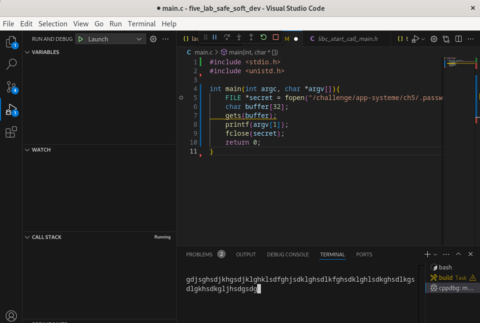

В лабораторной работе используется `gcc (Debian 12.2.0-14) 12.2.0` и `GNU gdb (Debian 13.1-3) 13.1`

1. Динамическая отладка программного обеспечения с бинарной уязвимостью.
	Программа было немного изменена в силу того, что в изначальном виде она защищена от переполнения буффера:
	1. Замена функции ```fgets()``` на ```gets()``` для предоставления возможности переполнить буффер:
		```C
		gets(buffer)
		```
	2. Ход работы программы:
		1. Запуск и определние ячейки памяти для переменной secret:
		
		2. Заполнение буффером из консоли:
		
		3. Изменение ячейки памяти в связи с переполнением буффера:
		
		4. Ошибка при попытке закрыть файл из-за изменившейся ссылки в переменной:
		
        
		
		### **Что за буффер, как он работает и к чему это приведет?**
		Буфер — это область памяти фиксированного размера, в нашем случае, ```char buffer[32]```, выделенная для хранения данных. В данном коде функция `gets(buffer)` считывает ввод пользователя без проверки длины, поэтому если ввести строку длиннее 32 символов, избыточные данные выйдут за границы буфера и начнут перезаписывать другие области памяти в стеке.
		При переполнении сначала переписываются соседние переменные, а затем может быть изменён адрес возврата функции `main`. Это особенно опасно, так как злоумышленник может записать вредоносный код (shellcode) в буфер и указать адрес возврата на начало этого кода, что приведёт к выполнению произвольных инструкций.
		Переполнение происходит из-за отсутствия ограничения на длину ввода, а его последствия включают сбои программы или выполнение вредоносного кода.

2. Анализ кода и поиск уязвимостей.
	Код для анализа:
	```C
	#include <stdio.h>
	#include <unistd.h>

	int main(int argc, char *argv[]){
		FILE *secret = fopen("/challenge/app-systeme/ch5/.passwd", "rt");
		char buffer[32];
		fgets(buffer, sizeof(buffer), secret);
		printf(argv[1]);
		fclose(secret);
		return 0;
	}
	```
	**Анализ слабых мест:**
	
	**1. Чтение файла без проверки ошибки:**
	если файл не существует, недоступен, или не может быть открыт по другой причине, программа не проверяет результат вызова `fopen`. В случае ошибки `secret` будет `NULL`, и вызов `fgets` приведёт к неопределённому поведению.
	
	**2. Уязвимость форматной строки:**
	вызов `printf` напрямую с пользовательским вводом делает программу уязвимой для атак форматной строки. Злоумышленник может передать в `argv[1]` строку вроде `"%x %x %x"` для чтения данных из памяти или `"%n"` для записи в память.

	**3. Работа с неинициализированным вводом:**
	в случае ошибки чтения содержимое `buffer` остаётся неинициализированным. Это может привести к неопределённому поведению, если `buffer` затем будет использоваться.
	
	**4. Нет проверки количества аргументов:**
	если программа вызывается без аргументов, обращение к `argv[1]` вызывает неопределённое поведение, так как массив аргументов не содержит второго элемента.
	
	**5. Ресурсы не освобождаются в случае ошибок:**
	если возникает ошибка в середине выполнения программы, файл не закрывается.

	**Исправленный код:**
	```C
	#include <stdio.h>
	#include <unistd.h>

	int main(int argc, char *argv[]) {
		// Проверяем, что передан хотя бы один аргумент. 
		// Без этой проверки обращение к argv[1] вызовет неопределённое поведение.
		if (argc < 2) {
			fprintf(stderr, "Usage: %s <input_string>\n", argv[0]);
			return 1; // Завершаем программу с ошибкой
		}

		// Открываем файл. Если открыть не удалось (например, файл не существует),
		// выводим сообщение об ошибке и завершаем выполнение.
		FILE *secret = fopen("/challenge/app-systeme/ch5/.passwd", "rt");
		if (!secret) {
			perror("Failed to open file"); // Выводим стандартное описание ошибки
			return 1; // Завершаем программу с ошибкой
		}

		// Инициализируем буфер для чтения строки.
		// Ограничиваем длину чтения размером буфера, чтобы избежать переполнения.
		char buffer[32];
		if (!fgets(buffer, sizeof(buffer), secret)) {
			// Если чтение из файла не удалось, выводим сообщение об ошибке.
			perror("Failed to read file");
			fclose(secret); // Закрываем файл перед завершением
			return 1; // Завершаем программу с ошибкой
		}

		// Печатаем переданный аргумент. Используем безопасный формат "%s",
		// чтобы предотвратить уязвимость форматной строки.
		printf("%s", argv[1]);

		// Закрываем файл, чтобы освободить ресурсы.
		fclose(secret);

		// Успешное завершение программы.
		return 0;
	}
	```
